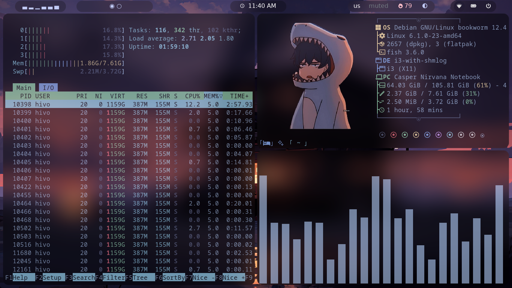

EL OSAMA OS - 24/25
My Debian i3wm dotfiles .
------------------------
 : 
----------------

--------------------------
depends 
-------
- shell : fish
- terminal : kitty 
- [polybar](https://github.com/jaagr/polybar)
- rofi 
- picom
- fastfetch
- nitrogen (wallpapers)
- Amberol (music player)
- nm-applet
- [FontAwesome](https://github.com/FortAwesome/Font-Awesome)
---------
- theme : Vortex-GTK
- icons : Papirus
- fonts : MartianMono Nerd
